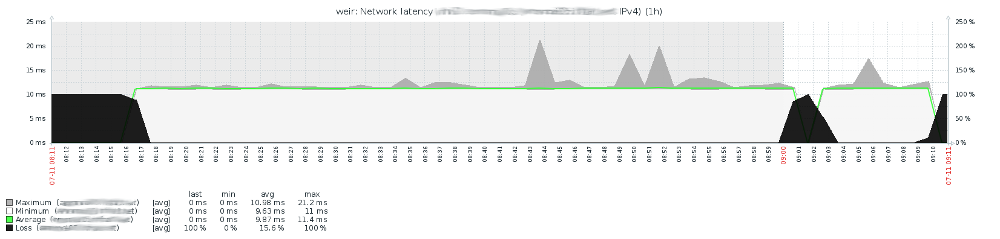

# Zabbix Fping

This template uses fping to ping systems from the zabbix agent. The idea is to use
the zabbix agent as a "point of view" from which to ping the targets. By using
different zabbix agents remote from the target, a more global view can be made
for the target regarding latency and packetloss.

The template collects:
* average latency
* packetloss
* maximum latency
* minimum latency

Using this information a graph is create using minimum, maximum and average latency
to the target. If any packetloss is present this is also shown in the graph.

Based on the packetloss the template provides three triggers, in order of
severity they are:
* Packet loss
* High packet loss
* Connection loss

The triggers have been set up to minimize the amount of notifications during
escalation and deescalation of packetloss to a target.

The idea is that when the recovery for a trigger is met, the lower triggers will
not trigger. The downside of this setup is that a high severity alert will remain
triggered even if the initial triggering value is no longer met.

For more information see:

[zabbix_fping](ZABBIX_FPING.md)
