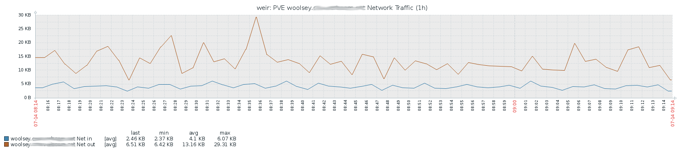

# Zabbix PVE

This template can be use for systems running Proxmox Virtual Environment. The
template aims to give insight into the VM's and containers running on the system,
without having to install agents on every system.

The template collects:
* CPU usage
* Memory usage
* Disk usage
* Network usage
* Uptime
* VM state

The information is used to create graphs for trend analysis.

Based on events, a number of triggers are available.

* CPU over 80%
* Disk space critical
* Memory critical
* Restart of container or VM
* Stopped container or VM
* Locked container or VM

It is possible to define a macro to define a PVE Pool that is used for test
systems. When a VM or container is in this pool, the triggers will not be used.

For more information see:

[zabbix_pve](ZABBIX_PVE.md)
